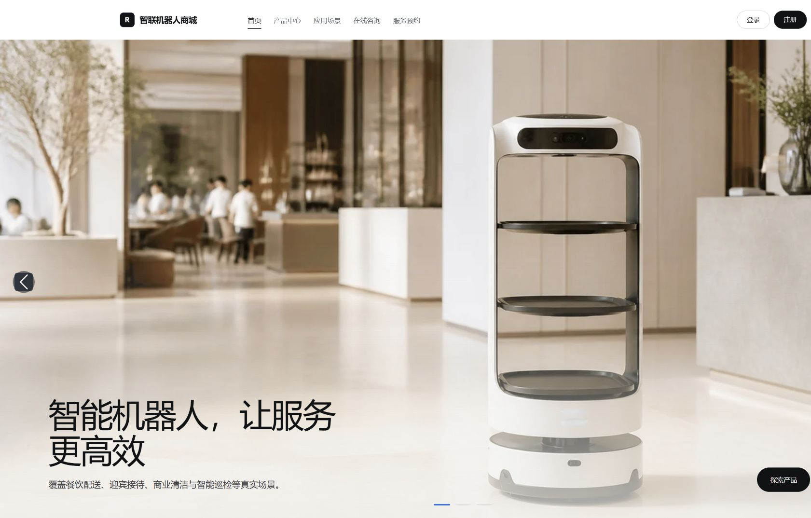
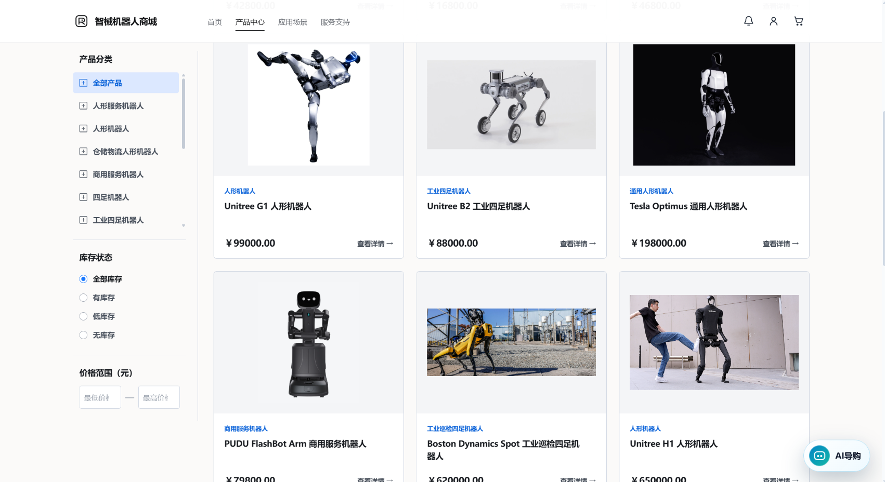
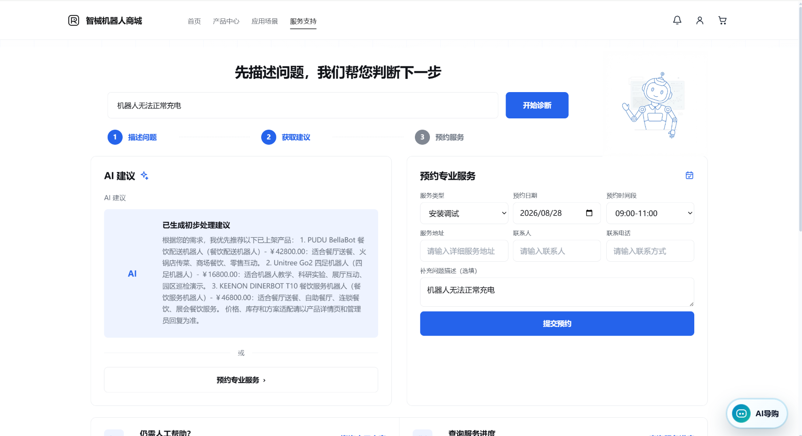
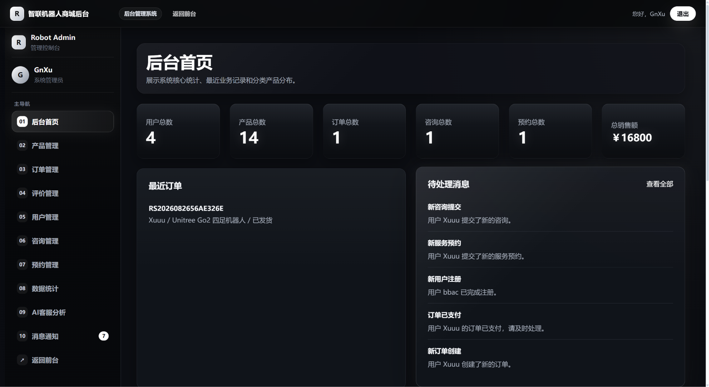
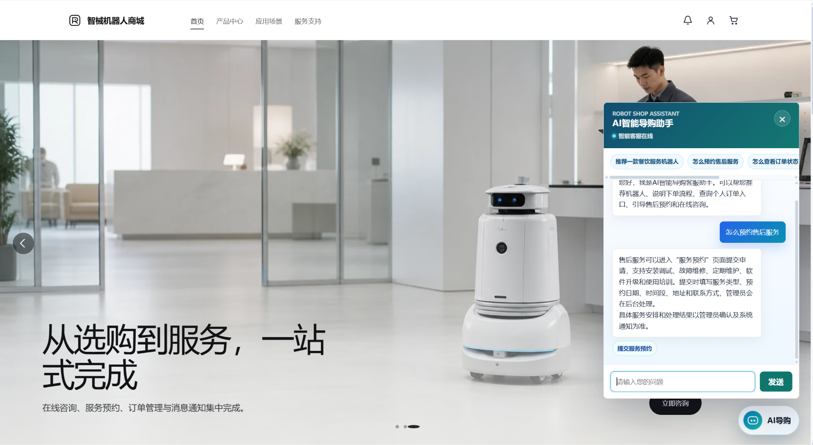
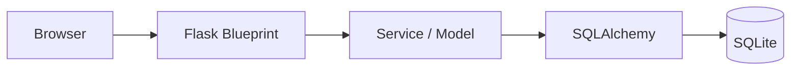
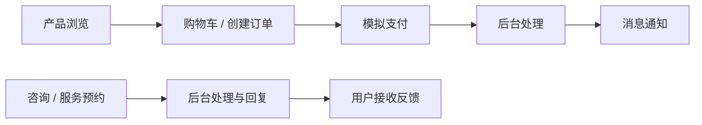

# Robot Shop

### 机器人销售与服务管理平台

一个基于 Flask 的全栈 Portfolio 项目，展示机器人产品销售、用户服务、后台运营与可选 AI 助手的完整 Web 业务流程。

**[Live Demo](https://robot.webxu.cn)**

**当前版本：** `v1.4-portfolio-release`



## 项目简介

Robot Shop 是一个使用 Flask 构建的机器人销售与服务管理 Web 项目，覆盖产品展示、模拟交易、用户服务和管理后台。项目面向 GitHub、简历与技术面试展示，重点呈现完整业务流程、模块化后端组织、权限控制、配置安全和自动化测试。

当前版本属于 **Portfolio / Demo**：支付、物流状态和业务数据均为模拟流程，不产生真实交易。

## 核心功能

### 产品与交易

- 首页精选产品、产品中心与产品详情展示
- 关键词、分类、价格、库存筛选及多种排序方式
- 产品参数、适用场景、相关产品、意向清单与用户评价
- 购物车增删改、库存校验、直接下单与购物车结算
- 模拟支付、订单状态筛选、订单详情与模拟物流进度

### 用户与服务

- 用户注册、登录、退出及个人中心
- 在线咨询与服务预约的统一服务支持入口
- 安装调试、故障维修、定期维护、软件升级和使用培训等预约类型
- 订单、咨询、预约和系统消息通知
- 用户评价与已购标识

### 管理后台

- 管理员权限校验与普通用户访问隔离
- 产品新增、编辑、上下架与删除
- 订单状态、物流状态及运营统计管理
- 用户、咨询回复、服务预约、评价和消息管理
- AI 会话统计与转人工线索整理

### AI 助手

- FAQ、本地规则与数据库上下文问答
- 基于规则、产品数据与可选模型的产品匹配建议
- 登录用户的订单、预约和咨询状态指引
- 售后问题分流与在线咨询入口
- 可选 OpenAI API；未配置时自动使用本地规则能力
- 按匿名 IP 或登录用户区分的请求限流

## 技术栈

| 分类 | 技术 |
| --- | --- |
| 后端 | Python、Flask、Flask-Login、Flask-SQLAlchemy、SQLAlchemy |
| 前端 | Jinja2、Bootstrap 5、JavaScript、CSS |
| 数据库 | SQLite |
| AI | 本地规则、数据库上下文、可选 OpenAI API |
| 配置 | python-dotenv、环境变量配置 |
| 测试 | pytest、Flask Test Client、隔离 SQLite 测试数据库 |

## 项目亮点

- **完整销售与服务闭环：** 产品浏览、购物车、订单、模拟支付、后台处理、消息通知、咨询与服务预约形成可演示的业务链路。
- **双角色权限体系：** 普通用户与管理员拥有清晰的页面权限和数据访问边界，受保护资源包含归属校验。
- **模块化 Flask 组织：** 16 个 Blueprint 分离前台、用户业务、管理后台和 AI API，并配合独立 Service 与 Model 层。
- **可降级 AI 助手：** 无外部 API 时仍可通过规则、FAQ 和数据库上下文工作，配置 OpenAI API 后可扩展对话能力。
- **配置与账号安全：** 密码哈希、安全跳转、生产环境密钥校验、数据库 URI 覆盖，以及不会重置已有凭据的演示账号初始化机制。
- **自动化验证：** 77 项 pytest 覆盖核心业务、权限、配置、账号初始化和 AI 限流。

## 系统截图

### 产品中心



### 服务支持与在线咨询



### 管理员后台



### AI 助手



## 架构与业务流程

### 应用结构



### 核心业务流程



## 本地运行

### 1. 获取项目

克隆仓库并进入项目目录：

```bash
git clone https://github.com/GoodnightXu2002/robot-shop.git robot_shop
cd robot_shop
```

### 2. 创建虚拟环境

```bash
python -m venv .venv
```

Windows PowerShell：

```powershell
.venv\Scripts\Activate.ps1
```

Windows CMD：

```bat
.venv\Scripts\activate.bat
```

macOS / Linux：

```bash
source .venv/bin/activate
```

### 3. 安装依赖

```bash
python -m pip install -r requirements.txt
```

### 4. 准备环境变量

Windows PowerShell：

```powershell
Copy-Item .env.example .env
```

Windows CMD：

```bat
copy .env.example .env
```

macOS / Linux：

```bash
cp .env.example .env
```

根据本地环境修改 `.env`，不要将真实密钥或密码提交到 Git。

### 5. 启动应用

```bash
python app.py
```

访问：`http://127.0.0.1:5000`

可选的本地环境检查：

```bash
python scripts/check_project.py
```

## Production Deployment

项目已真实部署至阿里云 ECS（Alibaba Cloud ECS，Ubuntu 22.04），可通过 [Live Demo](https://robot.webxu.cn) 访问。

```text
Internet → HTTPS/Nginx → Gunicorn → Flask → SQLite
```

- Nginx 提供反向代理，并将 HTTP 请求自动跳转至 HTTPS。
- systemd 管理 Gunicorn 服务，运行 Flask 应用。
- Let's Encrypt + Certbot 提供 HTTPS 证书与自动续期。
- SQLite 用于数据存储，已配置每日自动备份。
- SSH ED25519 Key 用于服务器管理。

可复用的 systemd 与 Nginx 示例配置位于 [`deploy/`](deploy/)。生产环境变量通过未纳入版本控制的 `.env` 提供。

## 环境变量

| 变量 | 说明 |
| --- | --- |
| `SECRET_KEY` | Flask 会话密钥；生产配置必须显式提供 |
| `DATABASE_URL` | SQLAlchemy 数据库 URI；默认 `sqlite:///robot_shop.db`，相对 SQLite 路径从项目根目录解析 |
| `OPENAI_API_KEY` | 可选；留空时 AI 助手使用本地规则与数据库上下文 |
| `OPENAI_MODEL` | 可选的 OpenAI 模型名称，默认 `gpt-4o-mini` |
| `ROBOT_SHOP_DEMO_ADMIN_USERNAME` | 可选的本地演示管理员用户名 |
| `ROBOT_SHOP_DEMO_ADMIN_PASSWORD` | 可选的本地演示管理员密码 |
| `ROBOT_SHOP_DEMO_USER_USERNAME` | 可选的本地演示普通用户名 |
| `ROBOT_SHOP_DEMO_USER_PASSWORD` | 可选的本地演示普通用户密码 |

项目不内置公开的固定账号密码。只有同时提供用户名和密码时才会创建对应演示账号；初始化不会重置已有账号的密码、联系方式或角色。

## 测试

运行完整测试：

```bash
python -m pytest
```

当前 Release 验证结果：**77 passed / 0 failed**。

测试覆盖：

- 登录流程、跳转安全与用户/管理员权限
- 产品、评价、购物车、意向清单、订单与模拟支付
- 在线咨询与服务预约
- 管理后台主要页面和状态更新
- 数据库路径配置与演示账号初始化
- AI 助手回退行为和请求限流

测试使用隔离的 SQLite 数据库，不会修改项目根目录下的本地数据库。

## 功能边界

- 支付为模拟流程，不接入支付网关，也不会产生真实扣款。
- 物流为模拟状态流转，不接入真实物流服务。
- 产品、库存、订单及服务数据用于 Demo 展示。
- SQLite 用于当前 Demo / Portfolio 的数据存储，主要面向小规模演示场景。
- OpenAI API 是可选能力；未配置时使用本地规则和数据库上下文。
- 项目已完成真实公网部署，但不宣称高可用、高并发、商业级支付或大规模生产能力。

## 版本信息

当前稳定版本：`v1.4-portfolio-release`
